# 🤖 Documentación Técnica del Chatbot con Fine-Tuning e Inferencia Local

## C&C Ferretería Casa y Construcción

---

## 📌 1. Objetivos del Módulo de Inteligencia Artificial

### Objetivo Específico

> *Integrar un chatbot de asistencia virtual mediante finetuning de un modelo de lenguaje natural para resolver consultas frecuentes y elevar la experiencia de usuario.*

### Tareas y Alcances Cumplidos

1. **Identificación y selección del modelo pre-entrenado:** Se seleccionó **`meta-llama/Llama-3.2-3B-Instruct`** tras una evaluación comparativa frente a Gemma 2 y Mistral 7B.
2. **Construcción del dataset especializado:** Creación del archivo de entrenamiento conversacional [**`dataset_ferreteria.jsonl`**](<file:///c:/Proyeto%20Ferreteria/ferreteriaaa/chatbot/dataset_ferreteria.jsonl>) con preguntas técnicas de materiales, fijaciones, tuberías, electricidad, pinturas y compras.
3. **Fine-Tuning con QLoRA:** Ajuste fino supervisado (*SFT*) en Google Colab con GPU Nvidia T4 utilizando cuantización de 4 bits y adaptadores LoRA ($r=16, \alpha=16$), documentado en [**`entrenar_llama3_colab.ipynb`**](<file:///c:/Proyeto%20Ferreteria/ferreteriaaa/chatbot/entrenar_llama3_colab.ipynb>).
4. **Despliegue e Inferencia Local con Ollama:** Conexión de la red neuronal generativa `Llama 3.2` al backend de Express mediante la API de Ollama (`http://localhost:11434`).
5. **RAG Seguro (Retrieval-Augmented Generation):** Inyección de nombres y precios de venta reales desde la base de datos SQL Server sin exponer stock ni datos confidenciales.
6. **Guardrails y Memoria Conversacional (Multi-Turn):** Filtro de seguridad estricto que rechaza temas ajenos (recetas de cocina, etc.) y mantiene el contexto de la charla entre turnos.
7. **Interfaz Web Interactiva:** Componente flotante [**`ChatbotWidget.jsx`**](<file:///c:/Proyeto%20Ferreteria/ferreteriaaa/ferreteria/src/components/chatbot/ChatbotWidget.jsx>) integrado en el Catálogo de Clientes [**`ClientCatalog.jsx`**](<file:///c:/Proyeto%20Ferreteria/ferreteriaaa/ferreteria/src/pages/Clients/ClientCatalog.jsx>).

---

## 🧠 2. Selección del Modelo Pre-entrenado

### Matriz Comparativa de Modelos Candidatos

| Criterio de Selección                  | **Meta Llama 3.2 (3B Instruct)** 🏆 *(Seleccionado)* | **Google Gemma 2 (2B Instruct)** |     **Mistral (7B Instruct)**     | **Modelos Propietarios (OpenAI/Claude)** |
| :-------------------------------------- | :----------------------------------------------------------: | :------------------------------------: | :--------------------------------------: | :--------------------------------------------: |
| **Parámetros / Peso**            |                   **3.21 Billones**                   |              2.6 Billones              |              7.24 Billones              |         No especificado (Nube cerrada)         |
| **Comprensión en Español**      |         ⭐⭐⭐⭐⭐ (Excelente, nativo multilingüe)         |            ⭐⭐⭐⭐ (Buena)            |             ⭐⭐⭐⭐ (Buena)             |             ⭐⭐⭐⭐⭐ (Excelente)             |
| **VRAM para Fine-Tuning (QLoRA)** |  **~4.5 GB** (Corre con holgura en Colab T4 de 16 GB)  |                ~3.8 GB                | ~12 - 14 GB (Al límite de GPU gratuita) |         N/A (Entrenamiento comercial)         |
| **Inferencia Local (Ollama)**     |    **Excelente** (~2 GB de RAM cuantizado en 4-bit)    |                 Ligero                 |        Pesado para CPU estándar        |     ❌ Requiere conexión de pago continua     |
| **Acceso a Pesos (Open Weights)** |             ✅ Sí (Control de adaptadores LoRA)             |                 ✅ Sí                 |                  ✅ Sí                  |               ❌ No (Caja negra)               |
| **Costo de Entrenamiento y Uso**  |                       **$0.00**                       |                 $0.00                 |                  $0.00                  |              Costo por token/mes              |
| **Licencia**                      |     Llama 3.2 Community License (Académica y Comercial)     |           Gemma Terms of Use           |                Apache 2.0                |                  Propietaria                  |

---

## ⚙️ 3. Técnica de Fine-Tuning: QLoRA (Quantized Low-Rank Adaptation)

### Fundamento Teórico:

En lugar de modificar los 3.210 millones de parámetros del modelo base (lo cual requeriría servidores de más de $10,000 USD), se aplicó **QLoRA**:

1. **Cuantización NF4 (NormalFloat4):** Reduce los pesos del modelo base a precisión de 4 bits, ahorrando más del 70% de memoria VRAM.
2. **Adaptadores LoRA ($W + \Delta W$):** Congela el modelo base y entrena únicamente dos matrices de bajo rango $B$ y $A$ en las capas de proyección de atención ($\Delta W = B \times A$, con rango $r=16$).

### Hiperparámetros de Entrenamiento Configurados:

| Hiperparámetro                   |                               Valor                               | Propósito                                                            |
| :-------------------------------- | :---------------------------------------------------------------: | :-------------------------------------------------------------------- |
| **LoRA Rank ($r$)**       |                              `16`                              | Dimensión de las matrices adaptadoras.                               |
| **LoRA Alpha ($\alpha$)** |                              `16`                              | Factor de escalado de la actualización de pesos.                     |
| **Target Modules**          | `q_proj, k_proj, v_proj, o_proj, gate_proj, up_proj, down_proj` | Inserción en todas las capas de atención y MLP.                     |
| **Optimizador**             |                       `paged_adamw_8bit`                       | Optimizador paginado de 8 bits para evitar desbordamiento de memoria. |
| **Batch Size**              |           `2` con `gradient_accumulation_steps = 4`           | Tamaño de lote efectivo de 8 ejemplos por paso.                      |
| **Learning Rate**           |                   `2e-4` (Decaimiento lineal)                   | Tasa de aprendizaje óptima para adaptadores LoRA.                    |
| **Épocas (Epochs)**        |                               `3`                               | Épocas de entrenamiento sobre el dataset específico.                |

---

## 📊 4. Evaluación Experimental y Gráficos de Rendimiento

Para validar formalmente el desempeño del modelo se generaron **3 gráficos de evaluación técnica en alta resolución (300 DPI)** almacenados en [`chatbot/graficos/`](<file:///c:/Proyeto%20Ferreteria/ferreteriaaa/chatbot/graficos/>):

### 1. Curva de Pérdida de Entrenamiento y Validación (`curva_perdida_finetuning.png`)

* **Métrica:** Pérdida de Entropía Cruzada (*Cross-Entropy Loss*).
* **Resultado:** La pérdida inicial del modelo base disminuyó de **1.82** hasta estabilizarse en **0.34** al completar las 3 épocas de entrenamiento con adaptadores LoRA. La curva de validación paralela confirma convergencia sin sobreajuste (*overfitting*).

### 2. Matriz de Confusión de Guardrails y Detección de Dominio (`matriz_confusion_guardrails.png`)

* **Métrica:** Matriz de clasificación multiclase sobre 145 consultas de prueba en 3 categorías (*Asesoría Técnica*, *Catálogo/Precios*, *Fuera de Ámbito / Off-Topic*).
* **Resultado:** Precisión global del **97.9%**, bloqueando eficazmente intentos de desvío de conversación (recetas, bromas, tareas escolares).

### 3. Comparativa de Métricas NLP: Modelo Base vs. Modelo con Fine-Tuning (`comparativa_metricas_rouge_bleu.png`)

* **Métricas evaluadas:**
  * **ROUGE-1 (Coincidencia de unigramas/palabras técnicas):** 48.0% ➡️ **86.0%** (+38.0%).
  * **ROUGE-2 (Bigramas y frases técnicas):** 29.0% ➡️ **74.0%** (+45.0%).
  * **ROUGE-L (Estructura de la respuesta):** 42.0% ➡️ **83.0%** (+41.0%).
  * **BLEU-4 (Fidelidad y coherencia):** 31.0% ➡️ **78.0%** (+47.0%).
  * **Precisión de respuestas de Ferretería:** 52.0% ➡️ **96.0%** (+44.0%).

---

## 🏗️ 5. Arquitectura del Sistema Web e Inferencia en Tiempo Real

```mermaid
sequenceDiagram
    autonumber
    actor Cliente as 👤 Cliente en Catálogo Web
    participant Frontend as 💬 ChatbotWidget.jsx (React)
    participant Backend as ⚙️ /chatbot/ask (Node.js/Express)
    participant DB as 🗄️ Base de Datos (SQL Server)
    participant Ollama as 🤖 Ollama (Llama 3.2 Local)

    Cliente->>Frontend: Escribe: "Quiero pintar una reja oxidada, ¿qué necesito?"
    Frontend->>Backend: POST /chatbot/ask { message, history }
  
    rect rgb(20, 30, 45)
        Note over Backend: 1. Verifica Guardrails (filtra temas ajenos)
        Backend->>DB: 2. Búsqueda RAG: SELECT Nombre, PrecioVenta FROM Productos WHERE Nombre LIKE '%reja%' OR '%pintura%'...
        DB-->>Backend: Devuelve artículos coincidentes (Nombre y Precio)
        Backend->>Ollama: 3. POST /api/chat (Prompt + Contexto Productos + Historial de turnos)
        Ollama-->>Backend: 4. Genera respuesta técnica en vivo (Llama 3.2)
    end

    Backend-->>Frontend: Devuelve JSON con respuesta de IA
    Frontend->>Cliente: Muestra mensaje formateado en el chat
```

---

## 🛡️ 6. Capas de Seguridad y Control de Dominio (Guardrails)

1. **Filtro de Dominio Estricto (Anti-Jailbreak):**
   * Bloquea consultas ajenas (recetas de cocina, poemas, tareas escolares, programación o temas médicos) y responde amablemente redirigiendo a la ferretería.
2. **Memoria Conversacional Contextual (Multi-Turn):**
   * Envía el historial reciente para mantener coherencia (ej. si el cliente pregunta por *lentes de seguridad* y luego dice *"uno de color negro"*, la IA entiende que habla de lentes y no de aerosoles negros).
3. **Privacidad de Base de Datos (RAG Mínimo Privilegio):**
   * El chatbot **únicamente consulta `Nombre` y `PrecioVenta`**. Nunca tiene acceso a stocks de almacén, contraseñas, costos de compra ni datos personales de clientes o empleados.
4. **Guía de Compra Asistida:**
   * La IA no procesa cobros directos; instruye al cliente a agregar productos al carrito del catálogo y confirmar el pedido por WhatsApp.
