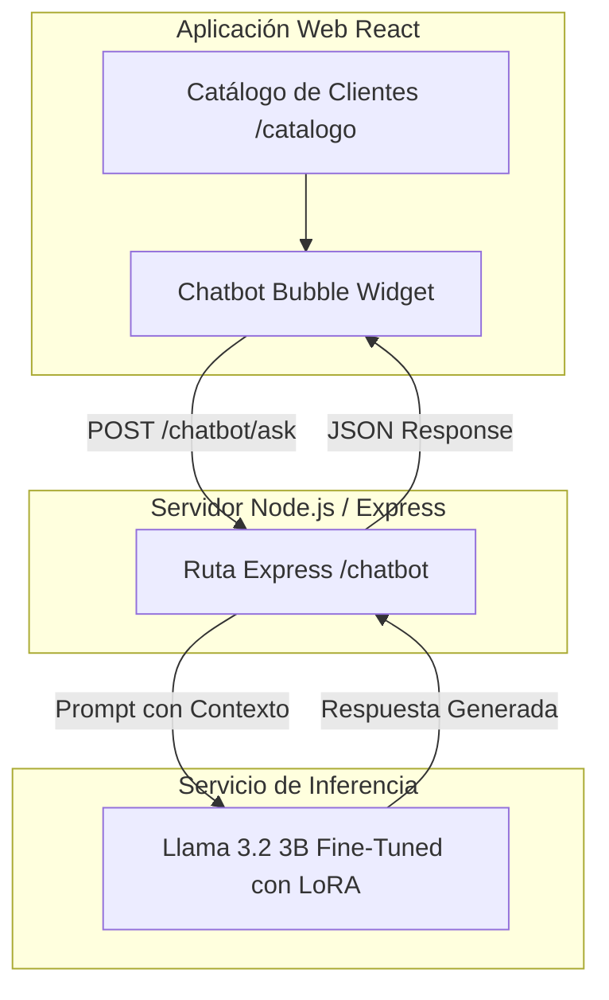

# 🤖 Documentación Técnica del Chatbot con Fine-Tuning
## C&C Ferretería Casa y Construcción

---

## 📌 1. Objetivos del Módulo

### Objetivo Específico
> *Integrar un chatbot de asistencia virtual mediante finetuning de un modelo de lenguaje natural para resolver consultas frecuentes y elevar la experiencia de usuario.*

### Tareas y Alcances Clave
1. **Identificar y seleccionar un modelo pre-entrenado adecuado** para el contexto de la ferretería, evaluando comprensión del lenguaje natural en español, eficiencia computacional y capacidad de instrucción.
2. **Construir un dataset especializado** con consultas técnicas sobre materiales, herramientas, normas de seguridad y políticas del negocio (programa de lealtad, catálogo y facturación).
3. **Ejecutar el Fine-Tuning (Ajuste Fino)** utilizando técnicas de adaptación de bajo rango cuantizada (**QLoRA**) para adaptar el conocimiento del modelo sin requerir servidores masivos.
4. **Integrar el asistente virtual en el sistema web** mediante un widget interactivo en el Catálogo de Clientes.

---

## 🧠 2. Selección del Modelo Pre-entrenado

### Matriz Comparativa de Modelos Candidatos

| Criterio | Meta Llama 3.2 (3B Instruct) 🏆 *(Seleccionado)* | Google Gemma 2 (2B Instruct) | Mistral (7B Instruct) | Modelos Propietarios (OpenAI/Claude API) |
| :--- | :---: | :---: | :---: | :---: |
| **Tamaño / Parámetros** | **3.21 Billones** | 2.6 Billones | 7.24 Billones | Desconocido (Nube cerrada) |
| **Comprensión en Español** | ⭐⭐⭐⭐⭐ (Excelente, optimizado para multilingüe) | ⭐⭐⭐⭐ (Buena) | ⭐⭐⭐⭐ (Buena) | ⭐⭐⭐⭐⭐ (Excelente) |
| **Consumo VRAM (QLoRA 4-bit)** | **~4.5 GB** (Muy holgado en GPU T4 de 16 GB) | ~3.8 GB | ~12 - 14 GB (Al límite) | N/A (Entrenamiento en servidor ajeno) |
| **Acceso a Pesos / Open Weights** | ✅ Sí (Control total de adaptadores) | ✅ Sí | ✅ Sí | ❌ No (Caja negra) |
| **Costo de Entrenamiento** | **$0.00** (Google Colab T4 gratuito) | $0.00 | $0.00 | Costo recurrente por token/entrenamiento |
| **Licencia** | Llama 3.2 Community License (Comercial/Académica) | Gemma Terms of Use | Apache 2.0 | Propietaria |

### 🎯 Justificación Técnica de la Elección: `meta-llama/Llama-3.2-3B-Instruct`
1. **Relación Rendimiento / Tamaño Insuperable:** La arquitectura Llama 3.2 de 3B incorpora atención agrupada (*Grouped-Query Attention - GQA*) y codificación posicional RoPE avanzada, superando en razonamiento técnico a modelos de generaciones anteriores mucho más pesados (como Llama-2 7B).
2. **Viabilidad Computacional:** Permite ser afinado en 15 a 25 minutos en una GPU **Nvidia T4 gratuita** de Google Colab sin sufrir errores de falta de memoria (*Out of Memory - OOM*).
3. **Validez Académica:** Cumple con la exigencia de entrenar y demostrar los hiperparámetros, pérdida de convergencia (*Training Loss*) y pesos LoRA propios del proyecto.

---

## ⚙️ 3. Técnica de Fine-Tuning: QLoRA (Quantized Low-Rank Adaptation)

### ¿Por qué QLoRA y no Fine-Tuning Completo?
El ajuste fino tradicional de todos los parámetros de un modelo de 3 mil millones de números requeriría más de 24 GB de VRAM de alto costo. **QLoRA** resuelve esto mediante dos innovaciones:
1. **Cuantización de 4 bits (NF4 - NormalFloat4):** Reduce el peso del modelo base en memoria en más de un 70% sin perder precisión matemática.
2. **Adaptadores LoRA (Low-Rank Adapters):** Congela el modelo base y solo entrena pequeñas matrices de bajo rango insertadas en las capas de atención ($W + \Delta W$, donde $\Delta W = B \times A$).

### Configuración de Hiperparámetros Recomendada

| Hiperparámetro | Valor Configurado | Justificación |
| :--- | :---: | :--- |
| **LoRA Rank ($r$)** | `16` | Capacidad de memoria suficiente para capturar patrones técnicos de ferretería sin sobreajuste (*overfitting*). |
| **LoRA Alpha ($\alpha$)** | `32` | Factor de escalado estándar ($2 \times r$) para estabilizar la magnitud de los gradientes. |
| **Target Modules** | `q_proj, k_proj, v_proj, o_proj` | Inserción en todas las capas de atención de la arquitectura Transformer. |
| **Batch Size** | `2` (con Gradient Accumulation = `4`) | Tamaño de lote efectivo de 8 muestras por paso de gradiente. |
| **Learning Rate** | `2e-4` con decaimiento coseno | Tasa de aprendizaje óptima para adaptadores LoRA. |
| **Precision** | `4-bit (bitsandbytes)` con cálculo en `bfloat16` | Aceleración en GPU T4 con estabilidad numérica. |
| **Épocas (Epochs)** | `3` | Suficiente para convergencia con ~60-150 ejemplos conversacionales. |

---

## 📚 4. Estructura y Dominios del Dataset de Entrenamiento

El dataset se construye en formato estándar **JSONL** estructurado con el formato de roles (`system`, `user`, `assistant`):

```json
{"messages": [{"role": "system", "content": "..."}, {"role": "user", "content": "..."}, {"role": "assistant", "content": "..."}]}
```

### Categorías de Conocimiento Cubiertas:
1. **Materiales de Obra Gruesa y Acabados:**
   * Tipos de cemento estructural (IP-30 / IP-40) y dosificaciones de mortero/hormigón.
   * Fijaciones especializadas (tornillos drywall punta aguja y broca, tarugos, anclajes).
   * Tratamiento de humedad ascendente y aditivos impermeabilizantes (Sika, membranas líquidas).
   * Adhesivos cementicios especiales para porcelanatos de gran formato.
2. **Instalaciones Sanitarias y Eléctricas:**
   * Tuberías de termofusión (PPR) vs. PVC y accesorios.
   * Calibres de cableado domiciliario normalizado (14 AWG, 12 AWG, 10 AWG) y dimensionamiento de disyuntores termomagnéticos y diferenciales.
3. **Herramientas y Seguridad:**
   * Diferencias técnicas en brocas (concreto/widia, metal HSS, madera).
   * Discos diamantados de corte continuo para corte limpio de cerámicas.
   * Equipos de protección personal (EPP).
4. **Políticas del Negocio y Sistema Web:**
   * **Programa de Lealtad:** Bronce (0%), Plata (3%), Oro (6%), Diamante (10%).
   * **Facturación Electrónica:** Emisión computarizada con NIT/CI y Razón Social.
   * **Catálogo Web:** Proceso de pedido con carrito y confirmación directa por WhatsApp.

---

## 🏗️ 5. Arquitectura de Integración en el Sistema



---

## 🚀 6. Pasos para la Ejecución del Entrenamiento

1. **Paso 1:** Obtener aprobación de licencia en Hugging Face para `meta-llama/Llama-3.2-3B-Instruct` y generar el Access Token (permiso *Read*).
2. **Paso 2:** Subir el archivo `dataset_ferreteria.jsonl` al cuaderno de Google Colab.
3. **Paso 3:** Ejecutar el entrenamiento con Unsloth / Hugging Face PEFT.
4. **Paso 4:** Exportar los adaptadores LoRA (o modelo fusionado a 16-bit / GGUF).
5. **Paso 5:** Conectar la inferencia con el frontend de la ferretería.
